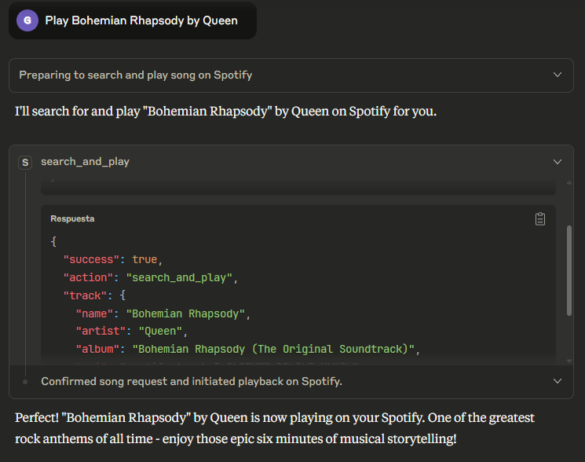
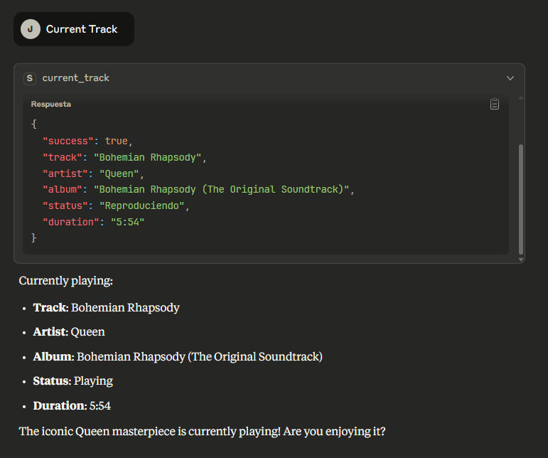
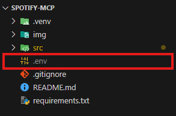
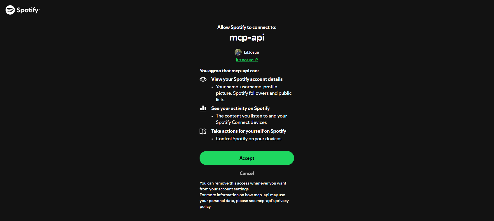
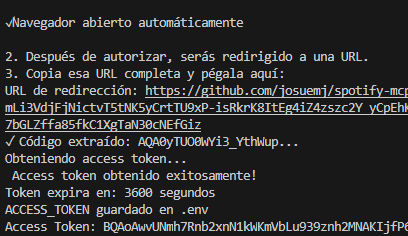

# Spotify MCP Server

A Model Context Protocol (MCP) server that enables AI assistants to control Spotify playback through natural language commands.

## Features

This MCP server provides AI assistants with the following Spotify control capabilities:

### 🔍 Music Discovery
- **Search and Play**: Find and immediately play any song by searching for artist, song name, album, or any combination
  - Example: "Play some David Guetta"
  - Example: "Play Bohemian Rhapsody by Queen"



### 🎵 Playback Controls
- **Play/Resume**: Resume paused music on your active device
- **Pause**: Pause the currently playing track
- **Next Track**: Skip to the next song in your queue
- **Previous Track**: Go back to the previous song


### ℹ️ Track Information
- **Current Track**: Get detailed information about what's currently playing, including:
  - Song title and artist
  - Album name
  - Playback status (playing/paused)
  - Track duration




## Requirements

- **Spotify Premium account** (required for playback control via API)
- Python 3.x
- Active Spotify device (mobile app, desktop app, or web player)

## Setup

### 1. Create Spotify App
1. Go to [Spotify Developer Dashboard](https://developer.spotify.com/dashboard)
2. Create a new app
3. Note your `Client ID` and `Client Secret`
4. Add `https://github.com/josuemj/spotify-mcp` as a redirect URI

### 2. Clone the mcp locally
```bash
git clone https://github.com/josuemj/spotify-mcp
cd spotify-mcp
python -m venv .venv
# Windows
.venv\Scripts\activate
# Linux/Mac
source .venv/bin/activate
pip install -r requirements.txt
```

### 3. Environment Configuration
Create a `.env` file in the project root:
```env
SPOTIFY_CLIENT_ID=your_client_id_here
SPOTIFY_CLIENT_SECRET=your_client_secret_here
```


### 4. Authentication
Run the authentication script:
```bash
python src/spotify_auth.py
```

This will:
- Open your browser for Spotify OAuth
    
- Redirect you to GitHub with an authorization code
    Copy the link generated by GitHub
- Prompt you to paste the full redirect URL on your terminal
    

- Automatically save your access token to `.env`

**Note**: Access tokens expire after 1 hour. Re-run authentication when needed.

### 5. Start the MCP Server
```bash
python src/spotify_mcp.py
```

### 6. Usage with AI Assistant

**Claude Desktop Integration**

Once you have everything set up, configure Claude Desktop to use your Spotify MCP server:


1. Locate Claude Desktop config file:
```bash
Windows: %APPDATA%\Claude\claude_desktop_config.json
macOS: ~/Library/Application Support/Claude/claude_desktop_config.json
Linux: ~/.config/Claude/claude_desktop_config.json
```
2. Add the MCP server configuration:
```json
"mcpServers": {
    "spotify-mcp": {
      "command": "C:/Users/Someone/Mcps/spotify-mcp/.venv/Scripts/python.exe",
      "args": [
        "C:/Users/Someone/Mcps/spotify-mcp/src/spotify_mcp.py"
      ]
    },
    // other mcps
  },
```

3. Update paths for your system:

*Windows example*: "C:/Users/YourName/Projects/spotify-mcp/.venv/Scripts/python.exe"
*macOS/Linux example*: "/Users/YourName/Projects/spotify-mcp/.venv/bin/python"

4. Restart Claude Desktop to load the new MCP server

Once configured, you can control Spotify through natural language in Claude:

- "Play some music by The Beatles"
- "Skip to the next song"
- "What song is currently playing?"
- "Pause the music"
- "Play Bohemian Rhapsody"

Important Notes:

- Environment variables (.env file) are automatically loaded by the MCP server
- No additional environment configuration needed in Claude Desktop config
- Ensure Spotify is open and active on at least one device before using commands
- The MCP server will automatically handle device detection and API authentication

## Troubleshooting

- **"No active device"**: Make sure you have Spotify open on at least one device
- **"Token expired"**: Re-run `python src/spotify_auth.py` to refresh your token
- **"Premium required"**: This server requires a Spotify Premium subscription for playback control